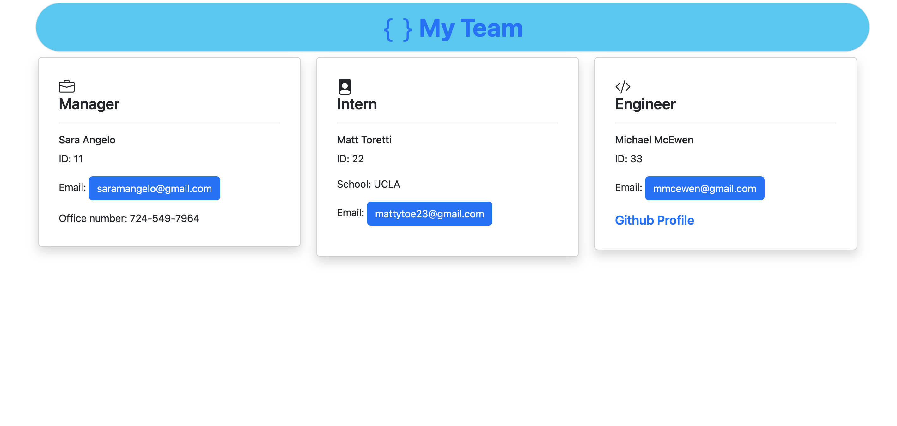

# dream-team 

## Description 
Dream-team is a Node.js command-line application that takes in information about employees on a software engineering team, ultimately then generating an HTML webpage that displays summaries for each entry.

## Link to Walk-through Video
[Link to video](https://drive.google.com/file/d/1qc7LI9Pj9BVRlysoKzma6Xcr5L7FUdDR/view)
  
## Table of Contents
    
- [dream-team](#dream-team)
  - [Description](#description)
  - [Link to Walk-through Video](#link-to-walk-through-video)
  - [Table of Contents](#table-of-contents)
  - [Installation](#installation)
  - [Usage](#usage)
  - [Credits](#credits)
  - [License](#license)
  - [Features](#features)
  - [How to Contribute](#how-to-contribute)
  - [Tests](#tests)
  - [Questions](#questions)
  
## Installation
In the command-line, "node index.js" must be typed. 
  
  
## Usage
In the command-line, questions will prompt for information regarding employee information pertaining to manager, intern, engineer.
   
  
## Credits
Bootstrap:  https://cdn.jsdelivr.net/npm/bootstrap@5.2.3/dist/css/bootstrap.min.css

Inquirer NPM package

Bootstrap Icons NPM package
  
## License
MIT

## Features
N/A

## How to Contribute
N/A
(https://www.contributor-covenant.org/)
  

## Tests
See tests folder (Employee, Engineer, Intern, Manager)
  

## Questions
Reach me at the links below with additional questions:
- Github: https://github.com/saramangelo
- Email: saramangelo@gmail.com
